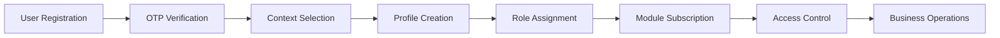
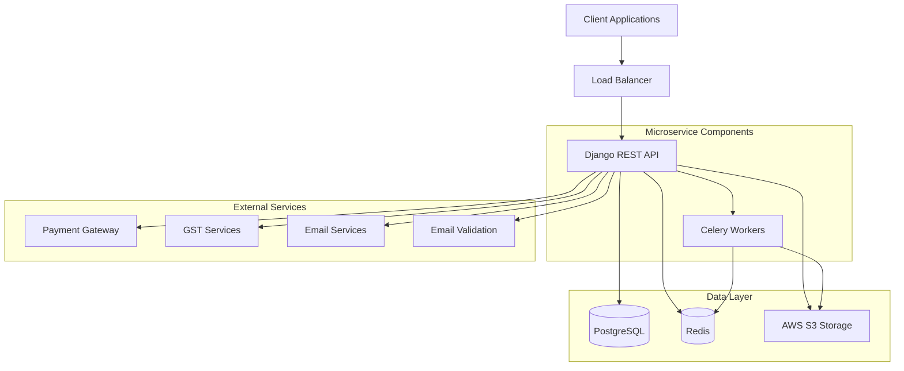
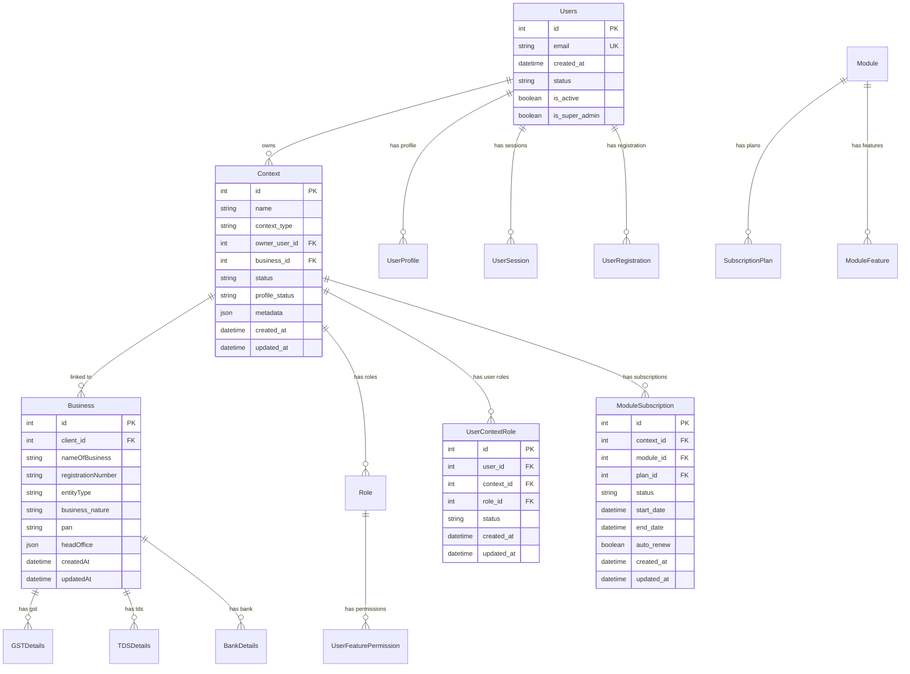

# Tara User Management - Comprehensive Authentication & Business Management System

A comprehensive Django REST API microservice for user authentication, business registration, context management, and role-based access control. Built with modern Python technologies and designed for enterprise-scale user and business management.

## 📋 What is User Management System?

User management is the comprehensive process of handling user authentication, business registration, context switching, role-based permissions, and subscription management. Our system provides a unified platform for managing both personal and business users with sophisticated access control and subscription features.

### 🎯 **Core User Management Features**

#### **Authentication & User Lifecycle**
- **User Registration**: Multiple registration flows (Standard, Business, Service-based)
- **OTP Verification**: Email-based OTP verification system
- **JWT Authentication**: Secure token-based authentication with refresh tokens
- **Password Management**: Forgot password, reset password, and change password functionality
- **User Activation**: Account activation and status management
- **Multi-factor Authentication**: Enhanced security with OTP verification

#### **Business Registration & Management**
- **Business Entity Registration**: Support for various business types (LLP, Private Limited, Partnership, etc.)
- **Business Details**: Comprehensive business information management
- **Document Management**: GST, TDS, License, DSC, and Bank details management
- **Branch Management**: Multi-branch business support
- **Business Logo**: Logo upload and management
- **MSME Registration**: MSME registration tracking and management

#### **Context Management System**
- **Personal Context**: Individual user accounts and profiles
- **Business Context**: Business-specific contexts with shared access
- **Context Switching**: Seamless switching between different contexts
- **Profile Status Tracking**: Incomplete, pending, and complete profile states
- **Context Metadata**: Flexible metadata storage for context-specific information

#### **Role-Based Access Control (RBAC)**
- **System Roles**: Pre-defined roles (Owner, Admin, Manager, Employee)
- **Custom Roles**: Create custom roles for specific business needs
- **Context-Specific Roles**: Different roles for different contexts
- **Permission Management**: Granular permission control at module level
- **Feature Permissions**: Module-specific feature access control

### 🔄 **User Management Workflow**



#### **Step-by-Step Process:**

1. **Registration**: User initiates registration with email and OTP verification
2. **Context Selection**: Choose between personal or business context
3. **Profile Setup**: Complete user profile and business details
4. **Role Assignment**: Assign appropriate roles based on context type
5. **Module Subscription**: Subscribe to required modules/features
6. **Permission Configuration**: Set up granular permissions
7. **Access Management**: Control access to different features and modules
8. **Business Operations**: Perform business operations within assigned context

### 📄 **Supported Business Entities**

#### **Entity Types**
- Sole Proprietor
- Partnership (Registered & Unregistered)
- Limited Liability Partnership (LLP)
- Hindu Undivided Family (HUF)
- Private Limited Company
- Public Company (Listed & Unlisted)
- One Person Company (OPC)
- Trust & Society

#### **Business Nature Categories**
- Technology & Software Services
- Financial Services
- Manufacturing & Construction
- Healthcare & Education
- Consulting & Legal Services
- Retail & E-commerce
- Real Estate & Hospitality
- And 20+ other categories

#### **Compliance & Regulatory Support**
- GST Registration & Filing
- TDS Management
- License Management
- Digital Signature Certificate (DSC)
- Bank Account Management
- Key Managerial Personnel (KMP) Tracking

### 🎨 **Context Management Architecture**

#### **Context Types**
```json
{
  "personal_context": {
    "name": "John Doe Personal",
    "context_type": "personal",
    "owner_user": "user_id",
    "profile_status": "complete",
    "metadata": {
      "kyc_completed": true,
      "verification_status": "verified"
    }
  },
  "business_context": {
    "name": "ABC Technologies Pvt Ltd",
    "context_type": "business",
    "business": "business_id",
    "profile_status": "complete",
    "metadata": {
      "registration_complete": true,
      "gst_registered": true,
      "modules_subscribed": ["payroll", "accounting"]
    }
  }
}
```

#### **Context Features**
- **Multi-tenant Architecture**: Isolated data per context
- **Profile Status Tracking**: Real-time profile completion status
- **Metadata Management**: Flexible JSON metadata storage
- **Business Integration**: Seamless business context creation
- **Permission Isolation**: Context-specific permission management

### 🔍 **User Search & Management**

#### **Advanced Filtering**
- **By Context Type**: Filter users by personal or business context
- **By Registration Status**: Filter by registration completion status
- **By Business Type**: Filter by business entity type
- **By Module Subscription**: Filter by subscribed modules
- **By Role**: Filter by user roles within contexts
- **By Activity Status**: Filter by active/inactive users

#### **Bulk Operations**
- **Bulk User Creation**: Excel-based user import
- **Bulk Role Assignment**: Mass role assignment
- **Bulk Permission Updates**: Batch permission management
- **Bulk Context Management**: Mass context operations

### 📊 **Subscription & Module Management**

#### **Module Types**
- **Personal Modules**: Individual-focused features
- **Business Modules**: Business-focused features
- **Suite Packages**: Combined module packages
- **Service-based**: Service-specific modules

#### **Subscription Plans**
- **Trial Plans**: Free trial subscriptions
- **Monthly Plans**: Monthly billing cycles
- **Annual Plans**: Yearly billing cycles
- **Custom Plans**: Flexible pricing models

#### **Usage Tracking**
- **Feature Usage**: Track usage of individual features
- **Usage Limits**: Enforce usage limits per subscription
- **Usage Analytics**: Detailed usage reports and analytics
- **Billing Integration**: Automated billing based on usage

### 🔐 **Security & Compliance**

#### **Data Security**
- **Field-level Encryption**: Sensitive data encryption
- **JWT Token Security**: Secure authentication tokens
- **Role-based Access**: Granular permission control
- **Audit Trails**: Complete history of all user actions
- **Secure File Storage**: AWS S3 with encryption

#### **Compliance Features**
- **Data Privacy**: GDPR-compliant data handling
- **Audit Logging**: Complete audit trail for compliance
- **Data Retention**: Automated data lifecycle management
- **Access Control**: Fine-grained access control
- **Session Management**: Secure session handling

## 🚀 Quick Start

### Prerequisites

- **Python 3.11+**
- **PostgreSQL 12+**
- **Redis 6+**
- **Docker & Docker Compose** (for containerized deployment)
- **AWS Account** (for S3 storage)

### Environment Setup

1. **Clone the repository**
   ```bash
   git clone <repository-url>
   cd Tara-AuthManagement-Backend
   ```

2. **Create virtual environment**
   ```bash
   python -m venv venv
   source venv/bin/activate  # On Windows: venv\Scripts\activate
   ```

3. **Install dependencies**
   ```bash
   pip install -r requirements.txt
   ```

4. **Environment Configuration**
   Create a `.env` file in the project root:
   ```env
   # Database Configuration
   DATABASE_HOST=localhost
   DATABASE_USERNAME=your_db_user
   DATABASE_PASSWORD=your_db_password
   DATABASE_NAME=user_management_db
   
   # AWS Configuration
   AWS_ACCESS_KEY_ID=your_aws_key
   AWS_SECRET_ACCESS_KEY=your_aws_secret
   AWS_PRIVATE_BUCKET_NAME=taradevelopmentprivate
   
   # Django Configuration
   SECRET_KEY=your-secret-key-here
   DEBUG=True
   ALLOWED_HOSTS=localhost,127.0.0.1
   
   # External Services
   MASTER_GST_EMAIL=your_gst_email
   MASTER_GST_CLIENT_ID=your_gst_client_id
   MASTER_GST_SECRET_KEY=your_gst_secret_key
   
   # Payment Gateway
   RAZORPAY_CLIENT_ID=your_razorpay_client_id
   RAZORPAY_CLIENT_SECRET=your_razorpay_secret
   
   # Email Configuration
   EMAIL_HOST_USER=your_email
   EMAIL_HOST_PASSWORD=your_email_password
   ```

5. **Database Setup**
   ```bash
   python manage.py makemigrations
   python manage.py migrate
   python manage.py createsuperuser
   ```

6. **Run Development Server**
   ```bash
   python manage.py runserver
   ```

## 🏗️ Architecture Overview

### System Architecture



### Core Components

- **Django REST Framework**: API endpoints and serialization
- **PostgreSQL**: Primary database for structured data
- **Redis**: Caching and Celery task queue
- **AWS S3**: File storage for documents and business assets
- **Celery**: Asynchronous task processing
- **Docker**: Containerization and deployment

### Data Models & Relationships



### Key Features

- **Multi-tenant Architecture**: Support for multiple contexts and businesses
- **Comprehensive User Management**: Complete user lifecycle management
- **Advanced Authentication**: JWT-based authentication with OTP verification
- **Flexible Role System**: Customizable role and permission management
- **Business Registration**: Complete business entity registration and management
- **Subscription Management**: Flexible module and feature subscription system
- **Real-time Analytics**: Live dashboards and usage analytics
- **API Documentation**: Auto-generated OpenAPI/Swagger docs

## 📚 API Documentation

### Base URL
```
http://localhost:8000/api/
```

### Authentication
JWT-based authentication with role-based permissions.

### Core Endpoints

#### User Authentication
- `POST /api/request-otp/` - Request OTP for registration
- `POST /api/auth/login` - User login
- `POST /api/auth/refresh-token` - Refresh JWT token
- `POST /api/forgot-password/` - Request password reset
- `POST /api/reset-password` - Reset password with token

**Example Request/Response:**
```bash
# User Login
POST /api/auth/login
Content-Type: application/json

{
    "email": "user@example.com",
    "password": "securepassword"
}

# Response
{
    "access": "eyJ0eXAiOiJKV1QiLCJhbGciOiJIUzI1NiJ9...",
    "refresh": "eyJ0eXAiOiJKV1QiLCJhbGciOiJIUzI1NiJ9...",
    "user": {
        "id": 1,
        "email": "user@example.com",
        "is_active": true,
        "created_at": "2024-12-01T10:00:00Z"
    }
}
```

#### Business Registration
- `POST /api/register/business-with-module/` - Register business with module subscription
- `GET /api/businesses/` - List all businesses
- `GET /api/businesses/{id}/` - Get business details
- `PUT /api/businesses/{id}/` - Update business information

**Example Request/Response:**
```bash
# Register Business
POST /api/register/business-with-module/
Content-Type: application/json
Authorization: Bearer <jwt_token>

{
    "business_name": "ABC Technologies Pvt Ltd",
    "entity_type": "privateLimitedCompany",
    "business_nature": "Technology",
    "registration_number": "U72900KA2024PTC123456",
    "pan": "ABCDE1234F",
    "head_office": {
        "address_line1": "123 Tech Street",
        "city": "Bangalore",
        "state": "Karnataka",
        "pincode": "560001"
    },
    "module_id": 1
}

# Response
{
    "success": true,
    "message": "Business registered successfully",
    "context": {
        "id": 1,
        "name": "ABC Technologies Pvt Ltd",
        "context_type": "business",
        "profile_status": "complete"
    },
    "business": {
        "id": 1,
        "nameOfBusiness": "ABC Technologies Pvt Ltd",
        "entityType": "privateLimitedCompany",
        "registrationNumber": "U72900KA2024PTC123456"
    }
}
```

#### Context Management
- `GET /api/user/contexts/` - List user contexts
- `POST /api/switch-context/` - Switch active context
- `GET /api/user/current-session/` - Get current session information

**Example Request/Response:**
```bash
# Switch Context
POST /api/switch-context/
Content-Type: application/json
Authorization: Bearer <jwt_token>

{
    "context_id": 2
}

# Response
{
    "success": true,
    "message": "Context switched successfully",
    "active_context": {
        "id": 2,
        "name": "My Business Context",
        "context_type": "business",
        "profile_status": "complete"
    }
}
```

#### Role & Permission Management
- `GET /api/roles/list` - List all roles
- `POST /api/roles` - Create new role
- `GET /api/user-feature-permissions/` - List user permissions
- `POST /api/user-feature-permissions/create` - Assign permissions

**Example Request/Response:**
```bash
# Create Role
POST /api/roles
Content-Type: application/json
Authorization: Bearer <jwt_token>

{
    "name": "Project Manager",
    "context": 1,
    "context_type": "business",
    "role_type": "manager",
    "description": "Project manager with elevated permissions"
}

# Response
{
    "success": true,
    "message": "Role created successfully",
    "role": {
        "id": 5,
        "name": "Project Manager",
        "context_type": "business",
        "role_type": "manager",
        "description": "Project manager with elevated permissions"
    }
}
```

#### Module & Subscription Management
- `GET /api/modules/list` - List all modules
- `GET /api/module-subscriptions/` - Get active subscriptions
- `POST /api/module-context-subscription/upgrade/` - Upgrade subscription
- `GET /api/usage-summary/{context_id}/` - Get usage summary

**Example Request/Response:**
```bash
# Get Usage Summary
GET /api/usage-summary/1/
Authorization: Bearer <jwt_token>

# Response
{
    "success": true,
    "context_id": 1,
    "data": [
        {
            "module_id": 1,
            "feature_key": "users_count",
            "usage_count": "5",
            "actual_count": "10",
            "is_limited": true
        }
    ]
}
```

### Error Handling

All endpoints return standardized error responses:

```json
{
    "success": false,
    "error": "Error message description",
    "details": "Additional error details if available",
    "code": "ERROR_CODE"
}
```

**Common HTTP Status Codes:**
- `200` - Success
- `201` - Created
- `400` - Bad Request
- `401` - Unauthorized
- `403` - Forbidden
- `404` - Not Found
- `500` - Internal Server Error

### Interactive API Documentation
Visit `http://localhost:8000/api/schema/swagger-ui/` for interactive API documentation.

## 🐳 Docker Deployment

### Development with Docker Compose

1. **Start services**
   ```bash
   docker-compose up -d
   ```

2. **Run migrations**
   ```bash
   docker-compose exec usermanagement python manage.py migrate
   ```

3. **Create superuser**
   ```bash
   docker-compose exec usermanagement python manage.py createsuperuser
   ```

### Production Deployment

The application includes AWS CodeBuild configuration for CI/CD:

- **Buildspec**: `buildspec.yml` - Automated Docker image building
- **Appspec**: `appspec.yml` - AWS CodeDeploy configuration
- **Dockerfile**: Multi-stage build for optimized production images

## 🔧 Development Guidelines

### Code Standards

- **PEP 8**: Follow Python style guidelines
- **Type Hints**: Use type annotations for better code clarity
- **Docstrings**: Document all functions and classes
- **Error Handling**: Implement comprehensive error handling
- **Testing**: Write unit tests for all new features

### Project Structure

```
Tara-AuthManagement-Backend/
├── Tara/                        # Django project settings
│   ├── settings/                # Environment-specific settings
│   │   ├── default.py           # Default configuration
│   │   └── dev.py              # Development configuration
│   ├── urls.py                  # URL routing
│   ├── wsgi.py                  # WSGI application
│   └── asgi.py                  # ASGI application
├── usermanagement/              # Main application
│   ├── models.py                # Database models
│   ├── views.py                 # API views
│   ├── serializers.py           # Data serialization
│   ├── urls.py                  # App URL patterns
│   ├── authentication.py        # Authentication logic
│   ├── business_registration_api.py # Business registration
│   ├── login_api.py             # Login functionality
│   ├── subscription_views.py    # Subscription management
│   ├── roles_views.py           # Role management
│   ├── feature_views.py         # Feature permissions
│   ├── payment_integration.py   # Payment processing
│   └── helpers.py               # Utility functions
├── scripts/                     # Deployment scripts
├── requirements.txt             # Python dependencies
├── Dockerfile                   # Container configuration
├── docker-compose.yml           # Local development setup
└── README.md                    # This file
```

### Database Migrations

```bash
# Create new migration
python manage.py makemigrations

# Apply migrations
python manage.py migrate

# Check migration status
python manage.py showmigrations
```

### Adding New Features

1. **Create/Update Models** in `models.py`
2. **Generate Migrations** with `makemigrations`
3. **Create Serializers** in `serializers.py`
4. **Implement Views** in respective controller files
5. **Add URL Patterns** in `urls.py`
6. **Write Tests** in `tests.py`
7. **Update Documentation**

## 🧪 Testing

### Running Tests
```bash
# Run all tests
python manage.py test

# Run specific app tests
python manage.py test usermanagement

# Run with coverage
coverage run --source='.' manage.py test
coverage report
```

### Test Structure
- Unit tests for models and serializers
- Integration tests for API endpoints
- Mock external services (S3, Redis, payment gateways)

## 📊 Performance Benchmarks

### Expected Response Times

| Endpoint | Method | Expected Response Time | Notes |
|----------|--------|----------------------|-------|
| `/api/auth/login` | POST | < 300ms | Authentication |
| `/api/user/contexts/` | GET | < 200ms | With pagination |
| `/api/businesses/` | GET | < 250ms | Cached response |
| `/api/register/business-with-module/` | POST | < 2s | Complex registration |
| `/api/module-subscriptions/` | GET | < 150ms | Subscription data |

### Performance Optimization

- **Database Queries**: Optimized with `select_related()` and `prefetch_related()`
- **Caching**: Redis caching for frequently accessed data
- **File Storage**: S3 with CDN for static assets
- **Pagination**: 20 items per page by default
- **Connection Pooling**: Database connection pooling enabled

### Load Testing Results

```bash
# Example load test with 100 concurrent users
ab -n 1000 -c 100 http://localhost:8000/api/auth/login

# Results:
# Requests per second: 450.00 [#/sec]
# Time per request: 222.222 [ms]
# Transfer rate: 2.8 [Kbytes/sec]
```

## 📊 Monitoring & Logging

### Health Checks
- **Application**: `GET /api/test/`
- **Database**: Built-in Django health checks
- **Redis**: Connection monitoring
- **S3**: File upload/download tests

### Monitoring Setup

#### Application Metrics
```python
# settings.py
LOGGING = {
    'version': 1,
    'disable_existing_loggers': False,
    'formatters': {
        'verbose': {
            'format': '{levelname} {asctime} {module} {process:d} {thread:d} {message}',
            'style': '{',
        },
    },
    'handlers': {
        'file': {
            'level': 'INFO',
            'class': 'logging.FileHandler',
            'filename': 'application.log',
            'formatter': 'verbose',
        },
        'console': {
            'class': 'logging.StreamHandler',
            'formatter': 'verbose'
        },
    },
    'loggers': {
        'django': {
            'handlers': ['console', 'file'],
            'level': 'INFO',
            'propagate': True,
        },
        'usermanagement': {
            'handlers': ['file', 'console'],
            'level': 'DEBUG',
            'propagate': True,
        },
    },
}
```

#### Key Metrics to Monitor
- **Response Time**: Average API response time
- **Error Rate**: 4xx and 5xx error percentage
- **Throughput**: Requests per second
- **Database Performance**: Query execution time
- **Memory Usage**: Application memory consumption
- **Authentication Success Rate**: Login success/failure rates

## 🔒 Security Considerations

### Production Checklist

- [ ] Change `SECRET_KEY` to a secure random value
- [ ] Set `DEBUG=False`
- [ ] Configure `ALLOWED_HOSTS` properly
- [ ] Use HTTPS in production
- [ ] Implement proper JWT authentication
- [ ] Set up database connection pooling
- [ ] Configure CORS properly
- [ ] Use environment variables for sensitive data
- [ ] Enable database backups
- [ ] Set up monitoring and alerting
- [ ] Encrypt sensitive user data
- [ ] Implement audit logging

### Environment Variables
Never commit sensitive data. Use environment variables for:
- Database credentials
- AWS keys
- Secret keys
- API tokens
- Payment gateway credentials
- GST service credentials
- Email service credentials

## 🚀 Performance Optimization

### Database Optimization
- Use `select_related()` and `prefetch_related()` for queries
- Implement database indexing for frequently queried fields
- Use database connection pooling
- Optimize user and business query patterns

### Caching Strategy
- Redis for session storage
- Cache frequently accessed user data
- Cache business and context information
- Implement cache invalidation strategies

### File Storage
- Use S3 for scalable file storage
- Implement CDN for static assets
- Optimize document upload and storage
- Compress large files

## 💾 Backup & Recovery Procedures

### Database Backup

#### Automated Daily Backups
```bash
#!/bin/bash
# backup_script.sh
DATE=$(date +%Y%m%d_%H%M%S)
BACKUP_DIR="/backups/postgresql"
DB_NAME="user_management_db"

# Create backup
pg_dump -h localhost -U $DB_USER $DB_NAME > $BACKUP_DIR/backup_$DATE.sql

# Compress backup
gzip $BACKUP_DIR/backup_$DATE.sql

# Keep only last 30 days
find $BACKUP_DIR -name "backup_*.sql.gz" -mtime +30 -delete
```

#### S3 File Backup
```bash
#!/bin/bash
# s3_backup.sh
S3_BUCKET="taradevelopmentprivate"
BACKUP_BUCKET="tara-user-mgmt-backup"

# Sync files to backup bucket
aws s3 sync s3://$S3_BUCKET s3://$BACKUP_BUCKET/$(date +%Y%m%d)/
```

### Recovery Procedures

#### Database Recovery
```bash
# Restore from backup
gunzip backup_20241201_120000.sql.gz
psql -h localhost -U $DB_USER $DB_NAME < backup_20241201_120000.sql
```

#### File Recovery
```bash
# Restore files from S3 backup
aws s3 sync s3://tara-user-mgmt-backup/20241201/ s3://taradevelopmentprivate/
```

### Backup Schedule
- **Database**: Daily at 2:00 AM
- **S3 Files**: Daily at 3:00 AM
- **Configuration**: Weekly on Sundays
- **Retention**: 30 days for daily, 12 months for weekly

## 🔧 Troubleshooting Guide

### Common Issues & Solutions

#### 1. Database Connection Issues
```bash
# Check database connectivity
python manage.py dbshell

# Common solutions:
# - Verify DATABASE_HOST, DATABASE_USERNAME, DATABASE_PASSWORD
# - Check PostgreSQL service status
# - Verify network connectivity
```

#### 2. Redis Connection Problems
```bash
# Test Redis connection
redis-cli ping

# Common solutions:
# - Check Redis service status
# - Verify Redis URL in settings
# - Check firewall rules
```

#### 3. S3 Upload Failures
```bash
# Test S3 connectivity
aws s3 ls s3://taradevelopmentprivate/

# Common solutions:
# - Verify AWS credentials
# - Check S3 bucket permissions
# - Verify bucket name in settings
```

#### 4. JWT Token Issues
```bash
# Check JWT configuration
python manage.py shell -c "from rest_framework_simplejwt.tokens import RefreshToken; print('JWT configured correctly')"

# Common solutions:
# - Verify SECRET_KEY is set
# - Check token expiration settings
# - Verify JWT authentication middleware
```

#### 5. Email OTP Issues
```bash
# Test email configuration
python manage.py shell -c "from django.core.mail import send_mail; send_mail('Test', 'Test message', 'from@example.com', ['to@example.com'])"

# Common solutions:
# - Verify EMAIL_HOST_USER and EMAIL_HOST_PASSWORD
# - Check email service provider settings
# - Verify SMTP configuration
```

### Log Locations

#### Application Logs
```bash
# Django logs
tail -f application.log

# Docker logs
docker-compose logs -f usermanagement
docker-compose logs -f celery_worker
```

#### System Logs
```bash
# Database logs
tail -f /var/log/postgresql/postgresql-*.log

# Redis logs
tail -f /var/log/redis/redis-server.log
```

### Performance Debugging

#### Database Query Analysis
```python
# Enable query logging in settings.py
LOGGING = {
    'loggers': {
        'django.db.backends': {
            'level': 'DEBUG',
            'handlers': ['console'],
        },
    },
}
```

#### API Response Time Analysis
```bash
# Use curl with timing
curl -w "@curl-format.txt" -o /dev/null -s "http://localhost:8000/api/auth/login"

# curl-format.txt content:
#      time_namelookup:  %{time_namelookup}\n
#         time_connect:  %{time_connect}\n
#      time_appconnect:  %{time_appconnect}\n
#     time_pretransfer:  %{time_pretransfer}\n
#        time_redirect:  %{time_redirect}\n
#   time_starttransfer:  %{time_starttransfer}\n
#                      ----------\n
#           time_total:  %{time_total}\n
```

### Health Check Endpoints

#### Application Health
```bash
# Basic health check
curl http://localhost:8000/api/test/

# Expected response:
{
    "message": "Hello, User Management is Workings!"
}
```

#### Database Health
```bash
# Database connectivity test
python manage.py check --database default
```

#### Redis Health
```bash
# Redis connectivity test
python manage.py shell -c "from django.core.cache import cache; print(cache.get('test', 'Redis is working'))"
```

## 🤝 Contributing

### Development Workflow

1. **Fork the repository**
2. **Create feature branch**: `git checkout -b feature/new-feature`
3. **Make changes** following coding standards
4. **Write tests** for new functionality
5. **Run tests** and ensure they pass
6. **Commit changes**: `git commit -m "Add new feature"`
7. **Push to branch**: `git push origin feature/new-feature`
8. **Create Pull Request**

### Code Review Process

- All code must be reviewed before merging
- Ensure tests pass and coverage is maintained
- Follow established coding standards
- Update documentation as needed

## 📞 Support & Contact

### Getting Help

- **Documentation**: Check this README and inline code comments
- **API Docs**: Visit `/api/schema/swagger-ui/` for interactive documentation
- **Issues**: Create GitHub issues for bugs or feature requests

### Team Contacts

- **Backend Team**: saikiranmekala@tarafirst.com, taraintern3@tarafirst.com, dharma@tarafirst.com
- **DevOps Team**: saikiranmekala@tarafirst.com, taraintern3@tarafirst.com
- **Project Lead**: saikiranmekala@tarafirst.com

## 📄 License

This project is proprietary software. All rights reserved.

---

**Version**: 1.0.0  
**Last Updated**: September 2025  
**Maintainer**: Development Team
